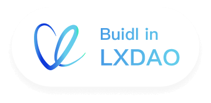

# My First Layer2 Frontend

MyFirstLayer2 is an education project for newbies to learn and interact with Layer2. As you can see from the name, our users are beginners curious about the knowledge and projects on Layer2. We will use funny and easy-to-understand diagrams and animation to explain Layer2 to newbies. Buidl in [LXDAO](https://lxdao.io/).

- MyFirstLayer2 Website: <https://layer2.myfirst.io/>
- LXDAO Website: <https://lxdao.io/>
- LXDAO Forum: <https://forum.lxdao.io/c/projects/010-myfirstlayer2/28>
- LXDAO Discord: <https://discord.lxdao.io>
- LXDAO Twitter: <https://twitter.com/LXDAO_Official>

As it is a public goods, all of the source code are open sourced:

- Main Website: <https://github.com/lxdao-official/myfirstlayer2-frontend>
- NFT Contract: <https://github.com/lxdao-official/myfirstlayer2-contract>

Enjoy!

## Start the app

Get the code first:

```
git clone https://github.com/lxdao-official/myfirstlayer2-frontend.git
cd myfirstlayer2-frontend
```

Copy `.env.sample` and rename it to `.env` and put data in it, then:

```
yarn install
yarn run dev
```

Then open <http://localhost:3000> start developing.

## `.env` explanation

- `NEXT_PUBLIC_CHAIN_ID` is the Chain ID, you can search from https://besu.hyperledger.org/en/stable/Concepts/NetworkID-And-ChainID and set an apposite value.
- `NEXT_PUBLIC_GOOGLE_ANALYTICS` is the application id in the google analytics tool, you can get from https://analytics.google.com.
- `NEXT_PUBLIC_CONTRACT_ADDRESS` is the smart contract address used to mint. The smart contract project has been [open source](https://github.com/lxdao-official/myfirstlayer2-contract), and you can deploy it owned.
- `NEXT_PUBLIC_INFURA_PROJECT_ID` is the project id in the `infura` service, you can get from https://infura.io.
- `NEXT_PUBLIC_NFT_STORAGE_TOKEN` is the API KEY of nft storage, you can get from https://nft.storage/.

```
NEXT_PUBLIC_GOOGLE_ANALYTICS=G-VPF0TRZGBT
NEXT_PUBLIC_CHAIN_ID=450
NEXT_PUBLIC_CONTRACT_ADDRESS=0x43c4Ebf956F7804596c333B209Ff246a476594DA
NEXT_PUBLIC_INFURA_PROJECT_ID=10a6......68e3
NEXT_PUBLIC_NFT_STORAGE_TOKEN=eyJhbGciOiJIUzI1NiIsInR5cCI6IkpXVCJ9......
```

## Code of Conduct

1. Please use English in this project by default (code comments, git commit message, variable name, etc).
2. Please install prettier plugin and keep the same code style.
3. Please have a discussion and confirmation first before introducing some new libraries or packages, keep them as simple as possible.

## I18N

Please use English Text by default like the following:

```
import { useTranslations } from 'next-intl';
 const t = useTranslations('Main');
...
<Typography variant="h6" component="div" gutterBottom>
  {t("Connect Wallet")}
</Typography>
...
```

## What is LXDAO?

LXDAO is an R&D-focused DAO in Web3. Our mission is: To bring together buidlers to buidl and maintain valuable projects for Web3, in a sustainable manner.

<a target="_blank" href="https://lxdao.io/"></a>
